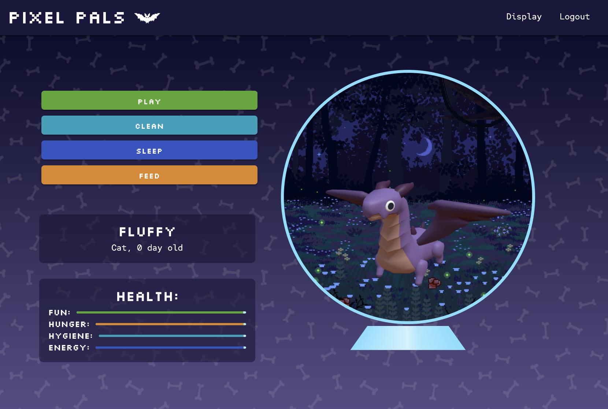

# pixel-paws

[Take care of your Pixel Paw here:]()  

## Description
Pixel Paws is a delightful pet simulator that draws inspiration from the iconic Tamagotchi. In this virtual pet experience, users get the chance to care for their digital companion, ensuring it remains happy and healthy. Just like real pets, Pixel Paw requires attention to its needs, such as feeding, cleaning, and playtime. Beware, neglecting your Pixel Paw may lead to unfortunate consequences—keep it thriving by giving it the love and care it deserves. The beauty of Pixel Paws lies in its portability; take your digital companion with you everywhere on your phone.

## Usage 
Getting started: Log into your Pixel Paw account and adopt a new pal   
Play: To keep your Pixel Paw entertained and happy, you can play with it  
Sleep: Just like real pets, Pixel Paws need sleep too! Make sure your Pixel Paw sleeps during the night or whenever it's tired  
Clean: Pixel Paws also need to be cleaned up after a while after they make a mess  
Feed: Your Pixel Paw needs to be fed regularly  
Health: Pay attention to your Pixel Paw's health meters. Make sure it gets enough food, sleep, and playtime to stay happy and healthy. 

## Technologies used
* React: The frontend of Pixel Paws is developed using React, providing a dynamic and responsive user interface.  
* GraphQL: Pixel Paws utilizes GraphQL for efficient communication between the client and server, enabling seamless data retrieval and updates.  
* Three.js: The inclusion of Three.js adds a 3D element to the game, enhancing the visual aesthetics and bringing Pixel Paw to life in a vibrant virtual environment.  
* Materialize: The Materialize framework is employed to create a sleek and user-friendly design, ensuring a polished and intuitive interface for players.  

## Contributors 
Diana  
Scott  
Opal  
Hannah  
Mathilde  

## License
Pixel Paws is licensed under the MIT License - see the [LICENSE.md](LICENSE.md) file for details.  